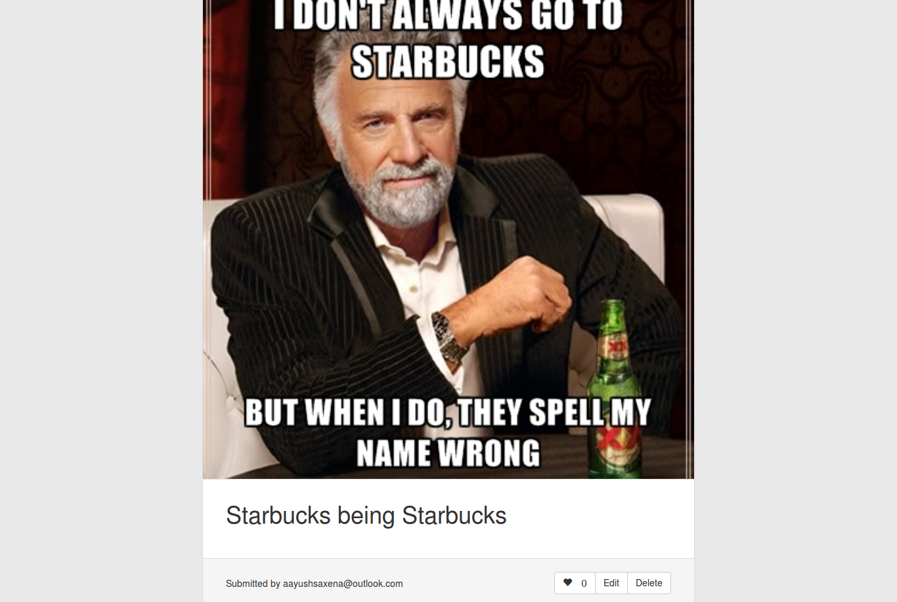
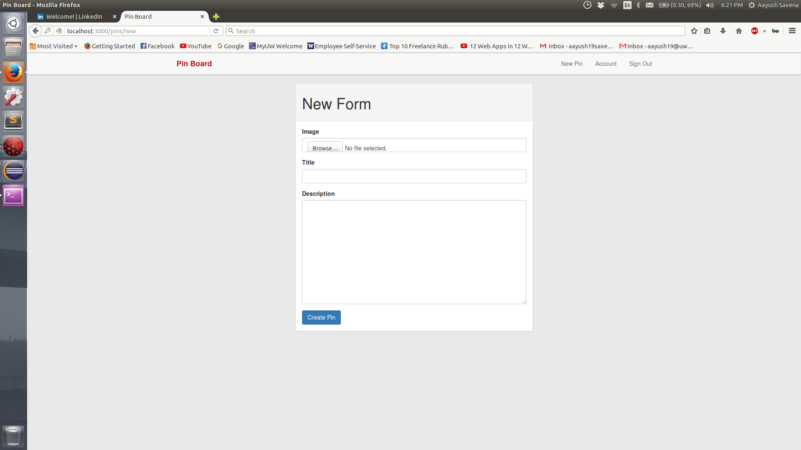

# Rails app which acts a clone of Pinterest. It lets you sign in and out of the application. The home page of the application displays all the pins by the users. A new user can add a pin, edit his existing pins and can also like other pins. 

 of the application")
 of the application")

